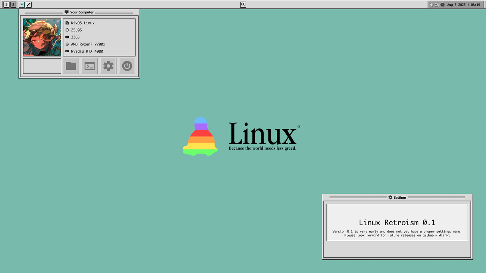

<div align="center">

# 🔴 Linux Thinkpadism 🔴

**A red-accented retro Hyprland desktop, built for a ThinkPad T420, on NixOS.**

</div>

<div align="center">

A fork of [Linux Retroism](https://github.com/diinki/linux-retroism) by diinki,
reworked into a single flake that builds the whole machine: compositor, shell,
themes, terminal, editor and power management.

</div>



> The screenshots still show upstream's teal theme. New ones for the red dark
> theme are still to be taken.

---

## What this is

One flake, one command, one machine. `nixos-rebuild switch --flake .#t420`
builds the system and the user environment together — there is no second
`home-manager switch` step, and nothing to copy into `~/.config` by hand.

| | |
| --- | --- |
| **Compositor** | Hyprland, configured in **Lua** (0.55 deprecated hyprlang) |
| **Shell** | Quickshell bar: workspaces, battery, clock, live CPU/RAM/temp |
| **Theme** | ThinkPad red, dark by default, applied to *every* toolkit |
| **Terminal** | WezTerm, tuned for Sandy Bridge graphics |
| **Files** | Yazi, themed to match |
| **Editor** | Neovim with a hand-written red colourscheme, LSP and completion |
| **Browser** | LibreWolf, hardened but usable, and dark from the first frame |
| **VPN** | Mullvad |
| **Power** | TLP, battery charge thresholds, zram, thermald |

---

## Installing on a fresh machine

This is the path from a blank disk to the desktop.

### 1. Install NixOS, minimally

Boot the installer and do a normal minimal install — no desktop environment,
no display manager. Set a password for your user and reboot into the console.

### 2. Get the repo

```sh
nix-shell -p git
git clone https://github.com/LuCaSkooo1/linux-thinkpadism ~/linux-thinkpadism
cd ~/linux-thinkpadism
```

### 3. Put in your own hardware config

This is the **one file** in the repo that is genuinely specific to your disks,
and the committed one is a placeholder that will not boot:

```sh
sudo nixos-generate-config --show-hardware-config \
  > hosts/t420/hardware-configuration.nix
```

### 4. Set your username

The flake defines it once, near the top:

```nix
username = "lucas";
```

Change it to yours if it differs. Nothing else needs editing.

### 5. Build

```sh
sudo nixos-rebuild switch --flake .#t420
```

The first build takes a while — it is compiling nothing, but it is downloading
a desktop. Afterwards, log in at the greeter.

### 6. Commit the lock file

The first build writes `flake.lock`, pinning the exact revision of every
input. **Commit it.** That file is what makes this reproducible: with it,
this repo builds the same desktop on any machine, at any point in the future.

```sh
git add flake.lock && git commit -m "Lock inputs"
```

To update later: `nix flake update && sudo nixos-rebuild switch --flake .#t420`.
If an update breaks something, the previous generation is still in the boot
menu, and `git checkout` on the lock file puts you back.

### 7. Check the panel name

Run `hyprctl monitors` and note the output name. On a T420 it is usually
`LVDS-1`, sometimes `eDP-1`. If yours differs, change it in `home/default.nix`
(`hyprland.monitor` and the `extraLua` block) — the lid switch binds use it.

---

## Layout

```
flake.nix              inputs, the t420 system, the exported modules
hosts/t420/            this machine: bootloader, user, hardware
home/                  this user: theme choice, monitor, git identity
nix/
  nixos.nix            system module — compositor, portals, power, fonts
  hm/                  home module — theming, programs, Hyprland wiring
  neovim.nix           Neovim with its plugins, from nixpkgs
  gtk-theme.nix        generates the light and dark Platinum variants
configs/
  hypr/lua/            the Hyprland config, as readable Lua modules
  wezterm/             WezTerm
  yazi/                Yazi
  nvim/                Neovim
  quickshell/          the bar and its popups (QML)
scripts/
  make-gtk-themes.py   derives both GTK themes from the upstream one
  recolor-icons.py     recolours the icon theme blue → red
```

The split is deliberate: `configs/` holds real, editable config files in each
tool's own language, and Nix only decides *where they go* and fills in the few
values that depend on the machine. You can read the Hyprland config without
reading any Nix.

---

## Hyprland is Lua now

Hyprland 0.55 deprecated `hyprlang` in favour of Lua, and this config targets
that. `hyprland.conf` is gone; `configs/hypr/lua/` holds numbered modules that
load in order:

| File | What is in it |
| --- | --- |
| `lib/theme.lua` | the palette, shared |
| `lib/programs.lua` | **generated** — commands and store paths from Nix |
| `10-options.lua` | look, feel, input, monitors |
| `20-rules.lua` | window and workspace rules |
| `30-binds.lua` | keybinds |
| `40-laptop.lua` | the F-row, the lid, the power button |
| `50-autostart.lua` | the daemons |
| `90-machine.lua` | **generated** — keyboard layout, loaded last so it wins |

`hypridle`, `hyprlock` and `hyprpaper` are still hyprlang — only the
compositor moved.

To add a bind without touching the repo's files, use `hyprland.extraLua` in
`home/default.nix`. It is appended after everything above, and Hyprland lets
the last call win.

---

## Keybinds

`SUPER` throughout.

| Keys | Action |
| --- | --- |
| `Return` | Terminal |
| `D` | App launcher |
| `E` / `SHIFT`+`E` | File manager / Yazi |
| `B` | Browser |
| `` ` `` | Scratchpad terminal |
| `T` / `SHIFT`+`T` | Appearance menu / toggle dark–light |
| `SHIFT` + `N` / `A` / `P` | Network / audio / performance TUI |
| `Q` | Close window |
| `F` / `SHIFT`+`F` | Fullscreen / maximize |
| `SHIFT`+`SPACE` | Toggle floating |
| `C` | Centre window |
| `1`–`0` | Workspace 1–10 |
| `SHIFT` + `1`–`0` | Move window to workspace |
| arrows, or `H` `N` `K` `L` | Move focus |
| `SHIFT` + arrows | Move window |
| `CTRL` + arrows | Resize window |
| `ALT`+`Tab` | Cycle windows |
| `SHIFT`+`S` / `Print` | Screenshot region / screen |
| `Escape` | Lock |

Scrolling over the desktop with `SUPER` held cycles workspaces; a three-finger
swipe does the same.

In Neovim, leader is `Space`; press it and wait, and which-key lists what
follows. In WezTerm, `CTRL`+`SHIFT`+`Space` is quick-select — it labels every
path, URL and store path on screen so you can copy one with two keystrokes.

---

## Why the dark theme took four settings

The original problem: a dark desktop, a white Firefox window, and a Bluetooth
tray menu that came up white with blank squares where icons should be.

That is not one bug. Four independent systems each decide, separately, whether
an app draws itself dark:

1. **GTK3** reads `gtk-theme-name` and `gtk-application-prefer-dark-theme`.
2. **GTK4 / libadwaita** largely ignores the theme name and reads
   `org.gnome.desktop.interface color-scheme`.
3. **Qt** follows its platform theme. The bar's tray menus are real `QMenu`s —
   `shell.qml` sets `UseQApplication` — so they follow the Qt palette, not any
   QML colour.
4. **Firefox, Chromium** ask the XDG **appearance portal**, which relays the
   same `color-scheme` key over D-Bus. Only `xdg-desktop-portal-gtk`
   implements it, so it has to be present *and* has to be the one that answers.

`nix/hm/theme.nix` sets all four from one value, and the bar's dark-mode
toggle rewrites the gsettings keys at runtime so the toggle actually moves
GTK apps.

The missing icons were separate: `ThinkpadismIcons` is a recoloured retro set
with no status icons at all, and it inherited only from Adwaita. It now
inherits `Papirus-Dark`, which is installed so the inheritance resolves.

Firefox's white *flash* on startup is a third thing again —
`browser.display.background_color`, painted before the portal has answered.
Pinned in `nix/hm/browsers.nix`.

### The GTK themes are generated

`scripts/make-gtk-themes.py` derives both variants from the upstream Platinum
theme, so the repo carries one copy of the widget geometry:

```sh
python3 scripts/make-gtk-themes.py --check   # preview
```

It works in HLS. Structural greys get their lightness inverted for the dark
variant — which also swaps the bevel highlights and shadows, so a ridge lit
from the top-left stays lit from the top-left. The `#9999FF` selection violet
is rotated onto ThinkPad red at matched lightness, so gradients keep their
shape. Semantic colours (the error red, amber warnings) are left alone. The
bitmap assets go through the same transform, which is the point: recolouring
only the CSS leaves black arrows on a black background.

---

## Things worth knowing about a T420

- **Graphics.** Sandy Bridge means `intel-vaapi-driver` (i965), not
  `intel-media-driver` — the latter is Broadwell and newer, and installing it
  here silently gets you software decoding. WezTerm is pinned to the OpenGL
  front end for the same reason: the HD 3000 has no usable Vulkan driver, and
  WebGpu falls back to software without saying so.
- **Battery.** Charging is capped at 85% and resumes below 75%. On a cell this
  old that is the single biggest thing you can do for its remaining life. Set
  `thinkpad.batteryThresholds = null` in `hosts/t420` if you need the range
  more.
- **Suspend.** `mem_sleep_default=deep`. s2idle on this generation is barely a
  power saving at all.
- **Blur and animations are off**, everywhere, on purpose. They are the two
  most expensive things a compositor does and this GPU has no headroom.
- **zram** at 50% of RAM. These shipped with 4–8GB of DDR3; compressed swap in
  RAM beats swapping to the SSD by a wide margin.
- **The lid**: closing it suspends on battery, and on AC or docked just turns
  the internal panel off and carries on.
- `bat-health` prints the battery's wear. `powertop` and `sensors` are
  installed.

---

## Terminal extras

`ani-cli` is installed, which searches and streams straight into mpv with no
browser involved. `yt-dlp`, `imv`, `cava` and `fastfetch` come with it, plus
`cmatrix`, `pipes-rs`, `cbonsai` and `tty-clock` for when you want the screen
to look busy. Turn any group off with `extras.{anime,media,toys} = false`.

Shell side: `eza`, `bat`, `ripgrep`, `fd`, `fzf`, `zoxide`, `lazygit`,
`starship`, and `rebuild` / `update` / `gc` aliases that point at this repo.

---

## Customising

Almost everything is an option on `programs.thinkpadism` in `home/default.nix`
or `services.thinkpadism` in `hosts/t420/default.nix`:

```nix
programs.thinkpadism = {
  theme = "thinkpad-dark";        # or thinkpad-light, yorha, cherry, ...
  terminal = "wezterm";
  browser = "librewolf";
  tools.network = "impala";       # if you run iwd rather than NetworkManager
  neovim.languageServers = false; # saves about a gigabyte
  extras.toys = false;
  hyprland.extraLua = '' ... '';
};
```

Colour schemes for the bar live in `configs/quickshell/Config.qml`; anything
added to the `themes` map shows up in the Appearance menu automatically.

To use just one piece in your own configuration, the flake exports
`nixosModules.thinkpadism`, `homeManagerModules.thinkpadism`, and the
individual packages.

### Development

```sh
nix develop          # qmlls, pillow, alejandra, nixd, stylua
nix flake check
quickshell -p ./configs/quickshell    # run the bar against this checkout
```

---

## Credits

Linux Retroism, the base this is forked from, is by
[diinki](https://github.com/diinki) —
[repo](https://github.com/diinki/linux-retroism) ·
[ko-fi](https://ko-fi.com/diinki) · [youtube](https://youtube.com/@diinkikot).

The Platinum GTK theme is diinki's fork of a Mac OS 9 pastiche. Wallpapers by
96YOTTEA and others, as credited upstream.

## License

MIT, as upstream. See `LICENSE`.
